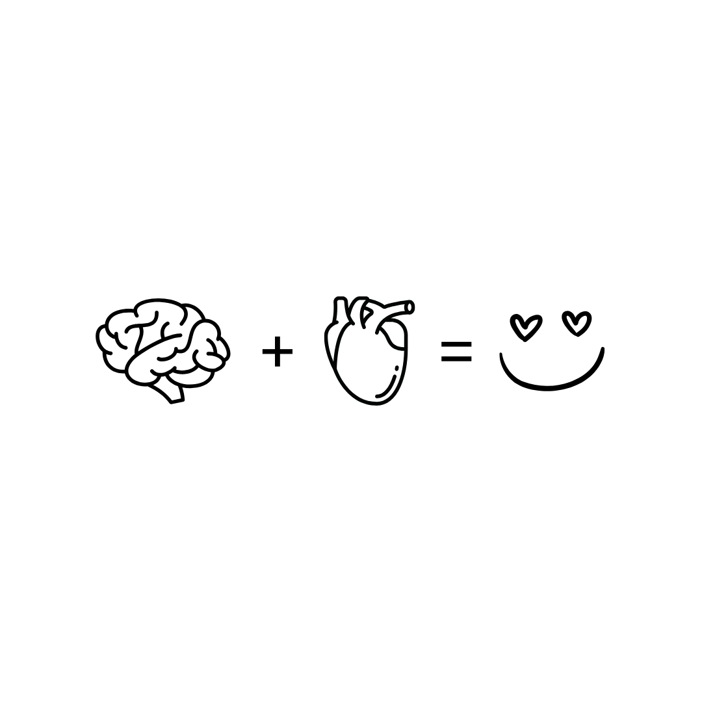

<p align="center">
  
</p>

<h1 align="center">The Gratefulness Challenge</h1>
<p align="center"><strong>30 Days to a New You</strong></p>
<p align="center">Brain + Heart = Gratitude</p>

<p align="center">
  <a href="https://basementghostmedia.github.io/gratefulness-challenge/"><strong>Try the app</strong></a>
</p>

---

## What this is

The Gratefulness Challenge is a 30-day gratitude journaling app. One prompt a day, a couple minutes to answer it, and three things you're grateful for. That's it. Do it for 30 days straight and something changes in how you see your life.

The app makes those 30 days feel like a journey instead of a chore. You build a streak, earn XP, unlock badges, and grow a tree from a seed to a golden tree as you go. When you finish, you're not the same person who started.

## Why this matters

Everybody knows gratitude is good for you. The research is everywhere: better sleep, lower stress, stronger relationships, a genuinely happier baseline. The problem was never knowing. The problem is doing it consistently.

Most journaling apps hand you infinite blank pages and no finish line. There's nothing to complete, so there's nothing to lose by skipping a day, and by day four the app is buried on your home screen. I wanted to build the opposite: a challenge with a clear start, a clear end, and a reason to show up every single day. The same mechanics that keep people coming back to their language streak or their workout plan, pointed at something that actually rewires how you think.

Thirty days is short enough to commit to and long enough to build a real habit. That's the whole bet.

## About me

I'm Rafael Rosario. I run [Basement Ghost](mailto:info@basementghost.com), where I do web and digital work for clients, and I spend my summers running AI workshops. I've spent years reading the books and listening to the podcasts, learning how to build things and betting on myself as an entrepreneur.

This app is personal for me. Gratitude isn't a product idea I stumbled onto, it's a practice that carried me through seasons where not much else did. I believe the discipline of writing down what's good, every day, even when the day was hard, genuinely changes people. I built this because I want more people to experience that shift, and because the tools that existed made it too easy to quit.

Basement Ghost is a small operation and this is a labor of love. If this project speaks to you, reach out: **info@basementghost.com**

## Where it stands (v0.5)

Working today:

- All 9 screens: splash, onboarding, home, journal, badges, community, profile, plans, day complete
- Real accounts (email + password) with private, synced journals via Supabase
- Guest mode that works with no account at all, and migrates your progress if you sign up later
- Server-side streaks, XP, and 12 badges, so progress is real and can't be faked
- 30 rotating daily prompts
- Tree avatar that grows through 5 stages as you journal
- Installable as an app on your phone (PWA), works offline, syncs when you're back
- Entries save offline and sync when you reconnect

Coming next: daily reminder notifications, a live community feed with sharing, photo and voice entries, completion certificates, and subscription plans (Individual, Family, and Annual).

## Tech

Deliberately simple: the entire front end is one HTML file. No framework, no build step.

| Layer | Choice |
|-------|--------|
| Front end | Vanilla HTML/CSS/JS, single file |
| Backend | Supabase (Postgres, Auth, Row Level Security) |
| Hosting | GitHub Pages |
| Offline | Service worker + localStorage cache |

Journal entries are private by design. Row Level Security means your entries are readable by you and nobody else, they can't be edited after the day ends, and all game stats are computed on the server.

## Run it locally

```bash
# any static server works; the service worker just needs http(s)
python3 -m http.server 8420
# then open http://localhost:8420
```

No install, no build step, no dependencies.

---

<p align="center">Built with intention by Rafael Rosario · Basement Ghost</p>
